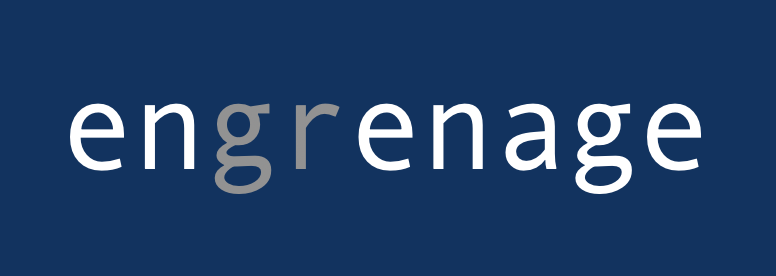
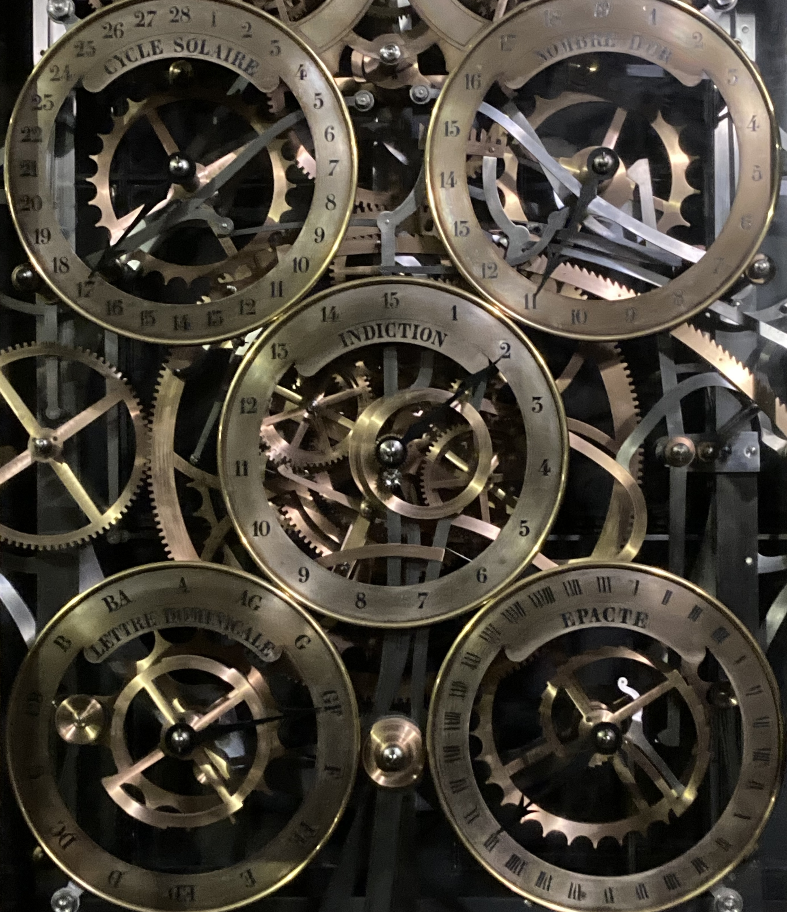

# Engrenage (the code formerly known as BabyGRChombo)

Engrenage is a code for solving 1D problems in Numerical Relativity (NR), which is the solution of the Einstein Equations of General Relativity (GR) using numerical methods.

It uses the reference metric framework in BSSN, where one evolves the deviations (which can be large) from a specific background metric.

The code currently includes:

    - backgrounds: a flat spherically symmetric background.
    - matter: a scalar field (obeying the [Klein Gordon equation](https://en.wikipedia.org/wiki/Klein–Gordon_equation) for a minimally coupled spin 0 field) as the matter source of the metric curvature.
    - examples - a black hole and a real scalar boson star (or oscillaton).

Warning: This code was not designed to be a good example of optimised python usage or even of numerical relativity. The goal was to write a code where some non trivial physical examples could be studied and users could get an overview of the different parts of a numerical relativity code in action, without the optimisation and level of detail that exists in a typical research code like its parent [GRChombo](https://github.com/GRTLCollaboration/GRChombo). It turns out that it is also pretty useful for research!

For more information and learning resources see the [wiki](https://github.com/GRChombo/engrenage/wiki).


(Engrenage is the French word for a system of gears. Understanding any code is very much like understanding how the parts of a mechanical system fit together. It is also very common when coding to be "pris dans l'engrenage".)

# Installation : choose your level

For all levels you need to have a python installation like [Anaconda](https://www.anaconda.com/download) that contains Jupyter notebooks. Please refer to [Useful resources](https://github.com/GRTLCollaboration/engrenage/wiki/Useful-Resources) for some tips on using anaconda to manage packages and getting the dependencies needed for engrenage to work.

**Level 1**: If you just want to play around with the code and don't expect to save any edits back to the repository, then just press the green "Code" button on the main repository page and download the zip of all the files - this is the simpler option if you are not too familiar with git. You should then unzip them, and navigate to the base directory in the terminal before you run `jupyter notebook` to see and edit the files.

**Level 2**: Use GitHub to fork and clone the repository. Please refer to [Useful resources](https://github.com/GRTLCollaboration/engrenage/wiki/Useful-Resources) for some tips if you are not familiar with the command line or GitHub.

1. [Fork and clone](https://docs.github.com/en/get-started/quickstart/fork-a-repo)
   this repository (or just download the zipped files). 

2. Having obtained a python distribution on your computer, create a [Python environment](https://docs.python.org/3/tutorial/venv.html) (e.g. in `./env`) using the terminal command:

    ```sh
    python3 -m venv ./env
    ```

3. Activate the environment and install the Python requirements:

    ```sh
    # Activate the Python environment
    . ./env/bin/activate
    # Install the requirements
    pip install -r ./requirements.txt
    ```

4. Run the Jupyter notebook:

    ```sh
    jupyter notebook
    ```
    

# Acknowledgements

This code is based on a private spherically adapted (but not spherically symmetric) code by Thomas Baumgarte, and the NRpy code of Zac Etienne, in particular the formalism used closely follows that described in the papers [Numerical relativity in spherical polar coordinates: Evolution calculations with the BSSN formulation](https://journals.aps.org/prd/abstract/10.1103/PhysRevD.87.044026) and [SENR/NRPy+: Numerical relativity in singular curvilinear coordinate systems](https://journals.aps.org/prd/abstract/10.1103/PhysRevD.97.064036).

This code has also benefitted from input from Nils Vu @nilsvu ("You don't use python environments? I don't even know where to start..."), Leo Stein @duetosymmetry ("Why wouldn't you use the existing numpy functions for that?") and bug spotting from Cristian Joana @cjoana and Cheng-Hsin Cheng @chcheng3 when this code debuted at the ICERM Numerical Relativity Community Summer School in August 2022, and David Sola Gil @David-Sola-Gil in the London LTCC course February 2023. Thanks also to Marcus Hatton @MarcusHatton for the addition of animation to the figures in the oscillaton example. A major upgrade to the grid and derivative classes was performed by Maxence Gerard @maxencegerard in 2024, and his contributions to the code strongly influenced the subsequent rewrite.

Currently the main developers of engrenage are Katy Clough at QMUL and Josu Aurrekoetxea at MIT.
